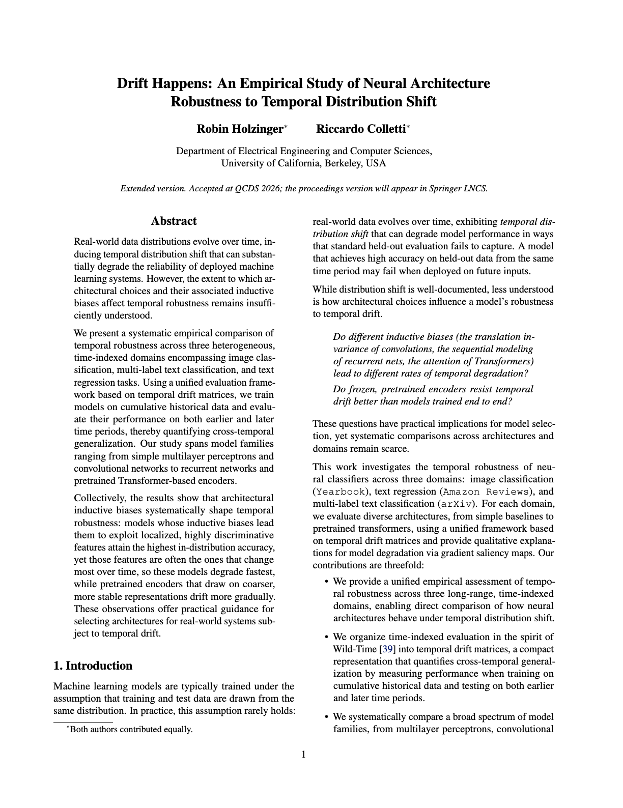

# Drift Happens: An Empirical Study of Neural Architecture Robustness to Temporal Distribution Shift

[](https://github.com/learning-mechanisms/drift-happens/actions/workflows/ci.yml)
[](https://github.com/learning-mechanisms/drift-happens/actions/workflows/ci.yml)
[](https://codecov.io/gh/learning-mechanisms/drift-happens)
[](#license)
[](https://wandb.ai/drift-happens/drift-happens)

### University of California, Berkeley: EECS

- `Robin Holzinger`<sup>\*</sup> 🎓 robin.holzinger [at] berkeley.edu
- `Riccardo Colletti`<sup>\*</sup> 🎓 riccardo_colletti [at] berkeley.edu

<sub>\* equal contribution</sub>

## 📘 Overview

This project studies how time-series neural classifiers handle temporal drift and performance degradation over time.
We analyze model robustness and adaptation strategies under dynamically changing data distributions.
Our goal is to identify architectures and retraining approaches that maintain high accuracy in non-stationary environments.

## 🌐 Interactive Website

Interactive visualizations and experiment dashboards for this project are available online:

🔗 [drift-happens.org](https://drift-happens.org/)

## 📄 Paper

**Drift Happens: An Empirical Study of Neural Architecture Robustness to Temporal Distribution Shift**
📍 _UC Berkeley · EECS_

[📄 **Read the full paper (PDF)**](https://drift-happens.org/drift-happens.pdf)

<p align="center">
  <a href="https://drift-happens.org/drift-happens.pdf">
    
  </a>
</p>

## 📊 Key Results at a Glance

The empirical results (temporal drift matrices, per-model robustness, and the
dataset analyses) are presented as animated and interactive figures on the
project website, and in the paper.

https://drift-happens.org/

The public [Weights & Biases project](https://wandb.ai/drift-happens/drift-happens)
hosts run histories, configs, logs, metrics, and curated artifacts for
reproducibility.

## Setup

1. Clone the repository
2. Install [pixi](https://pixi.dev) if you haven't already:

   ```bash
   # macOS (Homebrew)
   brew install pixi

   # Linux / general (curl installer)
   curl -fsSL https://pixi.sh/install.sh | bash
   ```

3. Install the pixi environment:

   ```bash
   cd drift-happens
   pixi install
   pixi run postinstall

   # This will register pre-commit hooks that run on git commit
   pixi run pre-commit-install

   # Run the local quality gates
   pixi run test
   pixi run typecheck
   pixi run lint
   pixi run format-check
   ```

4. You should be able to select the ipython kernel in `.pixi/envs/default/bin/python3` in Jupyter notebooks and run python scripts via:

   ```bash
   pixi run python your_script.py
   ```

5. Optional: You can use direnv to automatically activate the pixi environment when you `cd` into the project directory:

   ```bash
   # macOS (Homebrew)
   brew install direnv

   # Linux: see https://direnv.net/docs/installation.html
   # e.g. apt install direnv  or  curl -sfL https://direnv.net/install.sh | bash

   # one-time setup
   direnv allow
   ```

## Directory Structure

- `drift_happens/`: Python package and CLI implementation
- `configs/`: experiment presets and materialized snapshots
- `tests/`: unit and integration tests
- `docs/`: architecture and artifact policy notes
- `paper/`: curated paper assets
- `website/`: static website assets
- `artifacts/experiment_plans/`: curated small sweep launch plans
- `data/`: local datasets, ignored by git
- `artifacts/runs/`: local staged runtime outputs, ignored by git

## Setup Datasets

Datasets are downloaded into `data/` by default. Some datasets are large; set
`DRIFT_DATA_DIR` if you want them outside the repository checkout.

```bash
pixi run datasets-setup yearbook full
pixi run datasets-setup arxiv full
pixi run datasets-setup amazon-reviews-23 full
pixi run datasets-setup imdb-faces full
```

W&B and Hugging Face credentials are optional. Set `WANDB_PROJECT`,
`WANDB_ENTITY`, `WANDB_MODE`, `WANDB_TAGS`, `WANDB_UPLOAD_ARTIFACTS`, and
`WANDB_UPLOAD_CHECKPOINTS` for W&B; once `WANDB_PROJECT` is set, artifact
uploads default on while checkpoint uploads default off (set
`WANDB_UPLOAD_CHECKPOINTS` to enable them).
The public artifact table is available at
[wandb.ai/drift-happens/drift-happens](https://wandb.ai/drift-happens/drift-happens).
Set `HUGGINGFACE_TOKEN` or `HF_TOKEN` only for gated model access.
See `docs/wandb.md` and `docs/slurm.md` for cluster usage, and
`docs/artifacts.md` for pCloud/rclone artifact sync and dataset archive
publishing.

## Canonical Experiment Workflow

Materialize the Python preset registry before launching runs:

```bash
pixi run materialize
pixi run materialize-check
```

Run seed 0 first, inspect local or W&B state, then launch remaining seeds:

```bash
pixi run drift experiment run \
  configs/snapshots/presets/yearbook/smoke-mlp-s.json \
  --seed 0

pixi run drift experiment seeds status \
  configs/snapshots/presets/yearbook/smoke-mlp-s.json

pixi run experiment-plans
pixi run drift experiment sweep \
  artifacts/experiment_plans/p90_remaining_seeds_all_presets.yaml
```

Summarize completed local seeds and prune old attempts:

```bash
pixi run drift experiment seeds summarize \
  configs/snapshots/presets/yearbook/smoke-mlp-s.json \
  --csv --markdown

pixi run artifacts-ls
pixi run artifacts-gc-dry-run
```

Plot completed runtime drift matrices:

```bash
pixi run plots-results
pixi run plots-results-dry-run
```

Result plots are written as PDF files by default.

W&B and Hugging Face credentials are configured as described under [Setup Datasets](#setup-datasets) above.

Use `drift experiment train`, `drift experiment eval`, and `drift experiment run` as
the canonical run-management path.

## Reproducing the paper

The paper can be rebuilt from the curated W&B run artifacts without rerunning the
full training suite. Once the
[public W&B project](https://wandb.ai/drift-happens/drift-happens) exposes the
conference eval run artifacts, the local reproduction path is:

```bash
pixi install
pixi run postinstall

# Pull the public pCloud checkpoint bundle used for Yearbook saliency maps.
# This is separate from the W&B drift-matrix pull below.
pixi run artifacts-bundle-download-saliency

# Pull finished conference eval drift matrices from W&B into artifacts/runs/.
pixi run analysis-pull

# Freeze the pulled matrices into artifacts/analysis/*.parquet.
pixi run analysis-export

# Render paper figures, tables, appendix snippets, and the checksum manifest.
pixi run analysis-figures

# Regenerate the Yearbook saliency PDF used by the main paper.
pixi run analysis-saliency

# Export the website JSON files from the same frozen results.
pixi run analysis-site

# Rebuild generated paper assets in a scratch directory and compare checksums.
pixi run analysis-verify

# Build the paper PDFs (main-preprint.pdf, main-lncs.pdf) and sync website/drift-happens.pdf.
pixi run paper-pdf

# Package the LNCS sources for the QCDS 2026 proceedings into
# paper/dist/qcds2026-drift-happens-sources.zip.
pixi run paper-lncs-bundle
```

`artifacts-bundle-download-saliency` downloads the pCloud
`yearbook-saliency` checkpoint bundle into `artifacts/bundles/` for saliency
map regeneration. It does not populate `artifacts/runs/` or replace
`analysis-pull`. `analysis-saliency` is the materialized command that produced
`paper/img/drift_matrices/saliency_cnn_resnet_mlp.pdf`; it renders CNN-L,
ResNet-S, and MLP-L at train cutoffs 1950 and 1970 against evaluation years
1960, 1980, and 2000. It uses the downloaded saliency checkpoint bundle and the
local Yearbook image cache from `pixi run datasets-setup yearbook full`. The
task uses all available portraits for 1960 and 2000, and a deterministic
500-portrait sample for 1980, the only selected evaluation year above the
sampling cap. The sample seeds are `--sample-seed 8 --sample-seed 9
--sample-seed 32` in `--eval-year` order.

To refresh the saliency checkpoint bundle on a training server, make sure
`artifacts/runs/` contains the seed-0 Yearbook checkpoints for CNN-L, ResNet-S,
and MLP-L at train cutoffs 1950 and 1970, then run:

```bash
pixi run artifacts-bundle-saliency-rebuild
cat artifacts/bundles/yearbook-saliency/yearbook-saliency.tar.gz.sha256
wc -c artifacts/bundles/yearbook-saliency/yearbook-saliency.tar.gz
```

Upload `artifacts/bundles/yearbook-saliency/yearbook-saliency.tar.gz` and
update the bundle links and integrity metadata in
`drift_happens/utils/artifact_bundles.py` and `docs/artifacts.md`. Then
download the refreshed public bundle locally:

```bash
pixi run drift artifacts bundle download yearbook-saliency \
  --overwrite
pixi run analysis-saliency
```

For unpublished local experiments, the downloader also accepts
`--download-link`, `--expected-sha256`, and `--expected-size` overrides.
`--skip-integrity-check` is available for quick checks, but published
reproducibility bundles should be configured with the exact SHA-256 and byte
size.

`analysis-pull` reads W&B artifacts from the
`drift-happens/drift-happens` project and expects each finished conference eval
run artifact to contain `results/drift_matrix.json`. If the artifacts are still
private, run `wandb login` or set `WANDB_API_KEY` before pulling.
`analysis-export` downloads missing public Hugging Face text backbones when it
freezes model parameter counts; run
`pixi run drift analysis export --model-params-cache-only` to require an
already-populated local cache. A TeX installation with `pdflatex` and `bibtex`
is required only for `pixi run paper-pdf` and `pixi run paper-lncs-bundle`; the
analysis rendering itself is handled by the Pixi Python environment.
`paper-lncs-bundle` stages the LNCS sources into a scratch directory, compiles
them there to prove the bundle is self-contained, and zips the sources together
with the generated `.bbl` and reference PDF.

The public `public-full-runs` run bundle can also be downloaded from pCloud
when a single archive transfer is preferable to pulling matrices from W&B:

```bash
pixi run artifacts-bundle-download-full-runs
```

This downloads and extracts the run-bundle archive, `public-full-runs.tar.gz`,
under `artifacts/bundles/public-full-runs/staged/`. The extracted archive
contains a `runs/` directory with the curated conference run artifacts; copy or
sync that directory into `artifacts/runs/` before running
`pixi run analysis-export` if you use this archive path instead of
`pixi run analysis-pull`.

## Citation

If you use the paper, code, or frozen artifacts, please cite the paper. The
repository also includes [`CITATION.cff`](CITATION.cff), so GitHub's
**Cite this repository** button and citation managers can pick up the same
metadata.

```bibtex
@inproceedings{holzinger2026drifthappens,
  title = {{Drift Happens}: An Empirical Study of Neural Architecture Robustness to Temporal Distribution Shift},
  author = {Holzinger, Robin and Colletti, Riccardo},
  booktitle = {QCDS Workshop @ ECML-PKDD 2026},
  year = {2026},
  url = {https://drift-happens.org/drift-happens.pdf},
  note = {Code: \url{https://github.com/learning-mechanisms/drift-happens}},
}
```

If you want to cite the repository separately, use:

```bibtex
@misc{holzinger2026drifthappens_software,
  title = {{Drift Happens}},
  author = {Holzinger, Robin and Colletti, Riccardo},
  year = {2026},
  url = {https://github.com/learning-mechanisms/drift-happens},
}
```

## License

Code is licensed under the [Apache License 2.0](LICENSE). The paper, figures,
website, and documentation are licensed under
[Creative Commons Attribution 4.0 International](LICENSE-paper) where we own the
rights. Third-party references and dependencies remain under their respective
licenses.

## Public Artifact Boundary

Generated experiment outputs, trained checkpoints, raw datasets, robustness
tables, and plot dumps are not part of the source repository. Curated website and
paper assets stay in the repository; large reproducibility bundles should be
published through release assets, Zenodo, or a dedicated artifact repository.

See [docs/artifacts.md](docs/artifacts.md) and
[docs/architecture.md](docs/architecture.md) for the public repo policy and
runtime layout. See [docs/slurm.md](docs/slurm.md) for Slurm setup, smoke tests,
and dataset jobs. See
[docs/release-blockers.md](docs/release-blockers.md) before publishing a public
release. See [docs/results-plotting.md](docs/results-plotting.md) for reproducible
result plotting.
