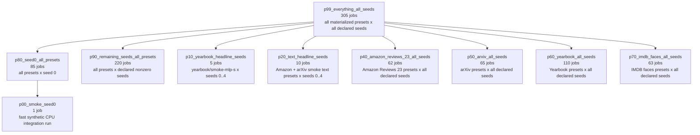

# Experiment Plan Coverage

This file visualizes the generated sweep plans in `artifacts/experiment_plans/`.
Each plan job is one `(preset config, seed)` run.

The plan prefixes are ordered by scope:

```text
p00     fast integration
p10-20  targeted result subsets
p40-70  dataset-specific all-seed sweeps
p80-99  full coverage plans
```

## Set View



Current set relationships:

```text
p99_everything_all_seeds
+-- p80_seed0_all_presets
|   +-- p00_smoke_seed0          # fast synthetic CPU integration job
+-- p90_remaining_seeds_all_presets
+-- dataset all-seed slices
|   +-- p40_amazon_reviews_23_all_seeds
|   +-- p50_arxiv_all_seeds
|   +-- p60_yearbook_all_seeds
|   +-- p70_imdb_faces_all_seeds
+-- targeted subsets
    +-- p10_yearbook_headline_seeds
    +-- p20_text_headline_seeds
```

`p99 = p80 union p90`, and `p80` and `p90` are disjoint by seed. `p00` is a
small integration-test subset of `p80`.

## Plan Summary

| Plan                                   | Jobs | Seeds                  | Scope                                                                          |
| -------------------------------------- | ---: | ---------------------- | ------------------------------------------------------------------------------ |
| `p00_smoke_seed0.yaml`                 |    1 | `0`                    | `smoke/synthetic-classification-cpu`, intended for fast integration testing.   |
| `p10_yearbook_headline_seeds.yaml`     |    5 | `0..4`                 | `yearbook/smoke-mlp-s`.                                                        |
| `p20_text_headline_seeds.yaml`         |   10 | `0..4`                 | `amazon-reviews-23/smoke-minilm-l6-frozen` and `arxiv/smoke-minilm-l6-frozen`. |
| `p40_amazon_reviews_23_all_seeds.yaml` |   62 | all declared seeds     | All Amazon Reviews 23 presets.                                                 |
| `p50_arxiv_all_seeds.yaml`             |   65 | all declared seeds     | All arXiv presets.                                                             |
| `p60_yearbook_all_seeds.yaml`          |  110 | all declared seeds     | All Yearbook presets.                                                          |
| `p70_imdb_faces_all_seeds.yaml`        |   63 | all declared seeds     | All IMDB faces presets.                                                        |
| `p80_seed0_all_presets.yaml`           |   85 | `0`                    | All materialized presets at seed 0.                                            |
| `p90_remaining_seeds_all_presets.yaml` |  220 | nonzero declared seeds | All materialized presets excluding seed 0.                                     |
| `p99_everything_all_seeds.yaml`        |  305 | all declared seeds     | Every materialized preset and every declared seed.                             |

## Seed Tree

```text
All declared runs: p99_everything_all_seeds (305)
|
+-- Targeted convenience subsets
|   |
|   +-- p10_yearbook_headline_seeds (5)
|   |   +-- yearbook/smoke-mlp-s: seeds 0, 1, 2, 3, 4
|   |
|   +-- p20_text_headline_seeds (10)
|   |   +-- amazon-reviews-23/smoke-minilm-l6-frozen: seeds 0, 1, 2, 3, 4
|   |   +-- arxiv/smoke-minilm-l6-frozen: seeds 0, 1, 2, 3, 4
|
+-- Dataset all-seed slices
|   |
|   +-- p40_amazon_reviews_23_all_seeds (62)
|   |   +-- amazon-reviews-23/smoke-minilm-l6-frozen: seeds 0, 1, 2, 3, 4
|   |   +-- amazon-reviews-23-conference/*: seeds 0, 1, 2
|   |
|   +-- p50_arxiv_all_seeds (65)
|   |   +-- arxiv/smoke-minilm-l6-frozen: seeds 0, 1, 2, 3, 4
|   |   +-- arxiv-conference/*: seeds 0, 1, 2
|   |
|   +-- p60_yearbook_all_seeds (110)
|   |   +-- yearbook/smoke-mlp-s: seeds 0, 1, 2, 3, 4
|   |   +-- yearbook-conference/*: seeds 0, 1, 2, 3, 4
|   |
|   +-- p70_imdb_faces_all_seeds (63)
|       +-- imdb-faces-conference/*: seeds 0, 1, 2
|
+-- Seed 0 full screen: p80_seed0_all_presets (85)
|   |
|   +-- Fast integration: p00_smoke_seed0 (1)
|       +-- smoke/synthetic-classification-cpu: seed 0
|
+-- Remaining declared seeds: p90_remaining_seeds_all_presets (220)
    |
    +-- Smoke presets: seeds 1, 2, 3, 4
    +-- Conference presets: seeds 1, 2, plus yearbook seed 3, 4
```

## Targeted Subsets

The targeted plans are not unique plans outside the main coverage. They are named
shortcuts into `p99`:

| Targeted plan                      | Jobs also in `p80` | Jobs not in `p80`                  |
| ---------------------------------- | ------------------ | ---------------------------------- |
| `p10_yearbook_headline_seeds.yaml` | seed `0`           | seeds `1..4`, covered by `p90`     |
| `p20_text_headline_seeds.yaml`     | seed `0`           | seeds `1..4` for both text presets |

In other words, each targeted plan includes one seed-0 job already present in `p80`
for each listed preset. Its nonzero-seed jobs are present in
`p90_remaining_seeds_all_presets.yaml`.

## Preset Families

```text
85 materialized presets
|
+-- Smoke presets, 4 total
|   +-- amazon-reviews-23/smoke-minilm-l6-frozen
|   +-- arxiv/smoke-minilm-l6-frozen
|   +-- smoke/synthetic-classification-cpu
|   +-- yearbook/smoke-mlp-s
|   +-- declared seeds: 0, 1, 2, 3, 4
|
+-- Conference presets, 81 total
    +-- amazon-reviews-23-conference/*, 19 presets
    +-- arxiv-conference/*, 20 presets
    +-- imdb-faces-conference/*, 21 presets
    +-- yearbook-conference/*, 21 presets
    +-- declared seeds: 0, 1, 2 except yearbook, which declares 0, 1, 2, 3, 4
```

That gives `p99 = 4 smoke presets * 5 seeds + 19 Amazon conference presets * 3 seeds + 20 arXiv conference presets * 3 seeds + 21 IMDB faces conference presets * 3 seeds + 21 Yearbook conference presets * 5 seeds = 305` jobs.
